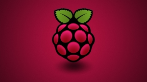

# raspberryPi

[comment]: <> (logo)        

   
Installation
------------
[Raspberry PI][1] la création de la carte sd avec [Pi Imager]

Documentation
-------------

##GPIO & BUS

Glossaire
---------
GPIO	General Purpose Input/Output					(Entrée/sortie à usage général)
UART	Universal Asynchronous Receive Transmit
I2C		Inter-Integrated Circuit
SPI		Serial Peripheral Interface
USB		Universal Serial Bus
HDMI	High-Definition Multimedia Interface

[1]: https://www.raspberrypi.com/
[Pi Imager]: https://www.raspberrypi.com/software/
[lien1_amateur]: http://emery.claude.free.fr/index.html
[example_markdown]:https://github.com/hendrychjan/valt-rpi  

